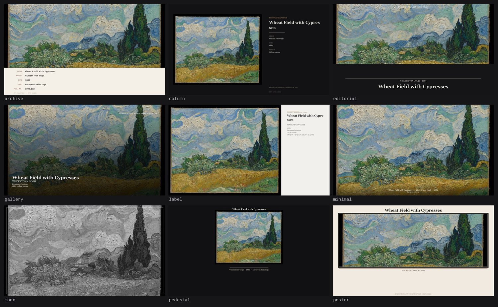
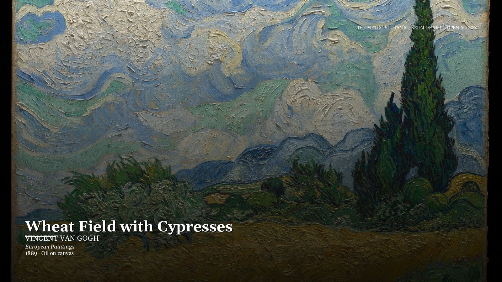

# Met Wallpaper — Art from the Met on your desktop

[中文](README.md) | **English**

Pulls random high-resolution artworks from The Met's public API, composes them into a wallpaper with the artwork's
background information laid out on the canvas, and applies it as your desktop wallpaper.



## Install

**No Python required** — grab a prebuilt package from [Releases](../../releases):

| Platform | File | First run |
|---|---|---|
| Windows 10/11 | `MetWallpaper.exe` | Double-click → the dashboard opens in your browser |
| macOS | `MetWallpaper-*-macos.dmg` | Open the DMG, drag the app into Applications. Unsigned build: right-click → Open, or run `xattr -dr com.apple.quarantine "/Applications/Met Wallpaper.app"` |

**From source** (Python 3.9+):

```
pip install -e ".[web]"     # [web] adds FastAPI + uvicorn for the dashboard
```

Dependencies: Pillow + requests (plus FastAPI/uvicorn for `serve`). Verified on Windows, macOS and Linux in CI.

## Usage

```
wallpaper next [--style gallery|minimal|label|...|random] [--pool all|favorites]
               [--avoid-recent N] [--no-apply]
wallpaper browse [--count 5] [--style ...]     # interactive: Enter preview / number apply / f favorite
wallpaper set <objectID> [--style ...]         # a specific artwork
wallpaper search <query>                       # search, then set
wallpaper favorite [--add ID] [--remove ID]    # manage favorites
wallpaper history [--limit 10]                 # recently applied wallpapers
wallpaper monitors                             # list displays + multi-monitor diagnostics
wallpaper schedule --install --every 4         # auto-rotate every 4 hours
wallpaper schedule --remove | --status
wallpaper serve [--host 127.0.0.1] [--port 8000]  # launch the web dashboard
wallpaper config [proxy_url]                   # view / set / clear config (e.g. proxy)
```

- `--no-apply`: compose only, don't touch the current wallpaper (for previewing)
- `--pool favorites`: draw from your favorites instead of a random pull
- `--avoid-recent N`: skip the artworks applied in the last N history entries (no repeats)
- Data directory (cache / logs / output / favorites / history): `%LOCALAPPDATA%\metwall` (Windows) ·
  `~/.local/share/metwall` (Linux) · `~/Library/Application Support/metwall` (macOS)
- Scheduled-task log: `<data dir>/cache/schedule.log`

## Web dashboard

`wallpaper serve` starts a browser-based management panel (single-process FastAPI app, default http://127.0.0.1:8000):


- **Masonry grid** (CSS columns — images keep their natural aspect ratio and stagger; infinite scroll triggers 1200px
  ahead of the fold, each new batch is de-duplicated)
- **Search / artist browsing**: keyword search in the top bar (Enter to submit) — a query matching an artist name returns
  only that artist's works; click an artist name on a detail page to see all of their works
- **A SQLite image library drives the candidate feed** (modeled on Pinterest / Xiaohongshu feeds):
  - unseen first (newly ingested works rank at the top); seen works ordered by **longest-unseen-first** (an LRU cycle —
    after viewing one image it won't reappear until every other image has had a turn)
  - **department shuffling**: the largest department group is split into even segments and separated by other
    departments (measured: max 3 consecutive works from the same department)
  - **low-water restocking**: when the unseen pool drops below 60, a background job fetches more
  - the frontend reports `seen` in batches after render (with a `last_seen` timestamp)
- **Warm start**: `serve` tops the cache pool up to 24 works on boot (reusing the seed pack and existing cache with zero
  network calls; only the shortfall is fetched)
- Hover a card and hit ♥ to favorite; detail drawer: lazy-loaded full image + full metadata + link to the official page
- **One-click apply**: pick a style in the detail drawer → set as wallpaper → applied locally immediately and recorded
  in history
- Left panel: favorites management and history browsing (time + style)
- **Artwork notes**: Chinese/English toggle inside the detail drawer (Wikipedia multilingual summary first, Met's own
  page text as fallback; hidden automatically on failure so browsing is never blocked)
- API: `/api/search`, `/api/candidates`, `/api/seen`, `/api/prefetch`, `/api/work/{id}`, `/api/favorites`,
  `/api/history`, `/api/styles`, `/api/notes/{id}?lang=zh|en`, `/api/apply/{id}?style=...`,
  `/media/img/{id}[_small].jpg` (downloaded and cached on demand)
- Image routes download on demand; thumbnails (`_small`) and full-resolution images are cached as separate files and
  never overwrite each other
- Met's API rate-limits occasionally: searches retry 3 times automatically, the candidates endpoint returns 503 with a
  message

### Seed pack (pre-bundled, so first run shows images instantly)

```
wallpaper seed --count 24    # pre-download works (metadata + thumbnails) into seed/
```

- `seed/` ships with the repository and the release packages; on first `serve` it is initialized into the data
  directory so the masonry grid has images right away
- Downloaded works automatically join the local cache pool and are returned first by the candidates endpoint (no extra
  logic needed)

### LAN sharing

```
wallpaper serve --host 0.0.0.0
```

The LAN address is printed on startup; Windows Firewall may block inbound traffic — run the suggested allow command.

### Proxy configuration for artwork notes

Wikipedia domains are often unreachable from mainland China on a direct connection (the Met page-text fallback needs no
proxy). With a proxy such as Clash running:

```
wallpaper config http://127.0.0.1:7897   # set proxy (enables Wikipedia notes)
wallpaper config                         # show current config
wallpaper config ""                      # clear
```

## Styles



| Style | Appearance |
|---|---|
| `gallery` | Full-bleed image + info card in the lower-left (title / artist / department / date · medium) + brand corner mark |
| `minimal` | Image-dominant; a slim italic line and the department along the bottom |
| `label` | Exhibition label: image left, text right, cream paper tone, stacked information |
| `editorial` | Magazine cover: image on top, dark panel below, large centered title + masthead |
| `mono` | Black-and-white photography: desaturated + thin frame + a single footer line |
| `poster` | Vintage poster: cream background + heavy border + large serif title |
| `archive` | Archive card: monospace label/value alignment, accession number |
| `pedestal` | Plinth: uncropped artwork centered on a dark base, title above, artist · date · department below (portrait-friendly) |
| `column` | Sidebar: uncropped artwork at left, dark information column at right (widescreen-friendly) |

Add your own by registering a function in `render.py`:

```python
@register("my-style")
def render_my_style(img, info, size):
    """img: PIL.Image — info: Met metadata dict — size: (w, h). Returns a PIL.Image."""
```

Preview every style offline without touching your wallpaper (uses the bundled `seed/` artwork, no network):

```
python tools/preview.py --size 2560x1440            # → preview/
python tools/preview.py --style pedestal --size 1080x1920
```

## Platform support

| Platform | Compose | Set wallpaper | Scheduled rotation |
|---|---|---|---|
| Windows 10/11 | ✅ verified | ✅ verified (SPI; per-monitor via `IDesktopWallpaper`) | ✅ verified (schtasks) |
| macOS | ✅ verified in CI | ⚠️ **not yet confirmed on real hardware** (osascript) | ⚠️ not confirmed (LaunchAgent) |
| Linux | ✅ verified in CI | ⚠️ not confirmed (gsettings / plasma-apply / feh) | ⚠️ not confirmed (crontab) |

Composing is exercised on all three platforms by CI on every push. Wallpaper *setting* on macOS and Linux is
implemented but unproven — if it misbehaves, `python tools/doctor.py --apply` prints exactly which step fails.
Adding a platform = implement `WallpaperSetter` and `Scheduler` under `platforms/`.

## Fonts

The renderer ships its own fonts instead of relying on system ones. Georgia and Courier New are **Microsoft-licensed
and cannot be redistributed**, Linux does not have them at all, and macOS keeps them in
`/System/Library/Fonts/Supplemental` — a directory Pillow does not search. Either way composing failed outright with
`OSError: cannot open resource` on every non-Windows platform.

| Bundled | Replaces | Licence |
|---|---|---|
| [Gelasio](https://fonts.google.com/specimen/Gelasio) | Georgia | SIL OFL 1.1 |
| [Cousine](https://fonts.google.com/specimen/Cousine) | Courier New | SIL OFL 1.1 |

Both are **metric-compatible** with the originals — identical character widths, line breaks and line heights, so the
layout does not change. `python tools/fetch_fonts.py` re-downloads them and prints the per-string width comparison,
refusing to finish if any metric drifts.

## Development

```
pip install -e ".[web,dev]"
pytest tests/ -v                # offline: renders every style from seed/ — no network
python tools/doctor.py          # environment + platform capability report
python tools/doctor.py --apply  # also really tries to set a wallpaper
python tools/preview.py         # render every style to preview/
bash platforms/tools/build.sh   # compile multiwallpaper.exe (per-monitor wallpapers, Windows)
```

CI runs the render suite on Windows, macOS and Linux for every push. A separate job attempts a real wallpaper change on
a macOS runner and posts the outcome to the job summary — macOS support is tracked there rather than assumed.

## Architecture

```
wallpaper.py   CLI entry point (next/browse/set/search/favorite/history/monitors/schedule/serve/config/seed)
met.py         Met API client + local cache (separate files for thumbnails and full images)
render.py      Layout engine: style registry (add a style with @register)
store.py       Favorites / history storage (pure data layer, reusable by the web backend as-is)
notes.py       Artwork notes: Wikipedia summaries + Met page-text fallback (proxy-aware)
library.py     Local image library (SQLite): seen/unseen and last-exposure tracking
server/        Web dashboard (single-process FastAPI app)
  app.py         API + on-demand image download routes + static page mounting
  static/        Frontend (vanilla JS, zero dependencies)
platforms/     Platform adapter layer: wallpaper setting + screen size + scheduling + data dir
  base.py        Abstract interfaces + user_data_dir()
  windows.py     Wallpaper via SPI + schtasks (verified)
  macos.py       osascript + LaunchAgent (unverified)
  linux.py       gsettings/plasma-apply/feh + crontab (unverified)
  tools/         multiwallpaper.cs — per-monitor wallpapers via the IDesktopWallpaper COM interface
assets/fonts/  Bundled open-licensed fonts (see Fonts above)
seed/          Pre-fetched artwork so the dashboard has images on first launch
tools/         fetch_fonts.py · preview.py · doctor.py
packaging/     PyInstaller entry point (single exe / .app)
```

## Scheduled task locations

| Platform | Location |
|---|---|
| Windows | `C:\Windows\System32\Tasks\MetWallpaper` (managed by schtasks) |
| Linux | User crontab (`crontab -l`) |
| macOS | `~/Library/LaunchAgents/com.oldspirit.metwallpaper.plist` |

## Known pitfalls

- `schtasks /TR` requires the `cmd /c` wrapper to be **wrapped in one more pair of outer quotes**
  (`cmd /c ""path" args > "log""`), and the log directory for the redirect must already exist — otherwise the task
  reports Last Result = 1
- The package must not be named `platform` (conflicts with the stdlib) — hence `platforms/`
- PyInstaller needs `--paths .`, otherwise it cannot see the top-level modules and the frozen exe dies with
  `ModuleNotFoundError: No module named 'wallpaper'`

## Credits

Artwork from [The Met Open Access](https://www.metmuseum.org/about-the-met/policies-and-documents/open-access) (CC0).

## License

[MIT](LICENSE) for the code. Bundled fonts are SIL OFL 1.1 — see `assets/fonts/*-OFL.txt`.
